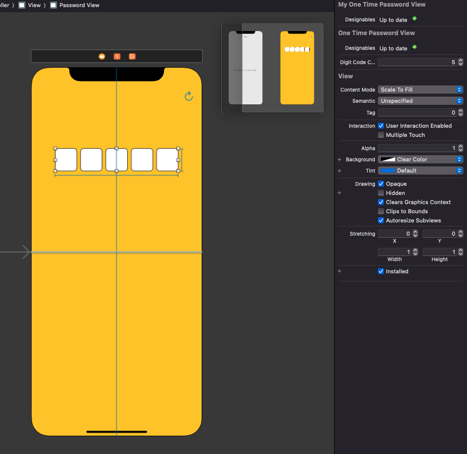

# WWOneTimePasswordView

[](https://developer.apple.com/swift/) [](https://developer.apple.com/swift/)  [](https://developer.apple.com/swift/) [](https://developer.apple.com/swift/)

## [Introduction - 簡介](https://swiftpackageindex.com/William-Weng)
- [Simple one-time password input text field.](https://medium.com/@dejanvu.developer/email-verification-with-sent-codes-in-ruby-on-rails-a-step-by-step-guide-039bcf194634)
- [簡單的一次性密碼輸入文字欄位。](https://zh.wikipedia.org/zh-tw/一次性密碼)




## [Installation with Swift Package Manager](https://medium.com/彼得潘的-swift-ios-app-開發問題解答集/使用-spm-安裝第三方套件-xcode-11-新功能-2c4ffcf85b4b)
```bash
dependencies: [
    .package(url: "https://github.com/William-Weng/WWOneTimePasswordView.git", .upToNextMajor(from: "1.1.3"))
]
```

## 可用函式
|函式|說明|
|-|-|
|initSetting(with:spacing:codeLabelFont:textColor:generalBorderParameter:selectedBorderParameter:)|初始化設定|
|reset()|重置畫面|

## WWOneTimePasswordViewDelegate
|函式|說明|
|-|-|
|oneTimePasswordView(_:status:password:replacementString:)|取得輸入的密碼|

## Example
```swift
import UIKit
import WWPrint
import WWOneTimePasswordView

@IBDesignable
final class MyOneTimePasswordView: WWOneTimePasswordView {}

final class ViewController: UIViewController {
    
    @IBOutlet weak var passwordView: MyOneTimePasswordView!
    
    override func viewDidLoad() {
        super.viewDidLoad()
        passwordView.initSetting(with: 6)
        passwordView.delegate = self
    }
    
    override func touchesBegan(_ touches: Set<UITouch>, with event: UIEvent?) {
        super.touchesBegan(touches, with: event)
        view.endEditing(true)
    }
    
    @IBAction func resetCodeView(_ sender: UIBarButtonItem) {
        passwordView.reset()
    }
}

extension ViewController: WWOneTimePasswordViewDelegate {
    
    func oneTimePasswordView(_ oneTimePasswordView: WWOneTimePasswordView, status: WWOneTimePasswordView.Status, password: String, replacementString: String?) {
        wwPrint("\(status) => \(password) => \(replacementString ?? "<nil>")")
    }
}
```
